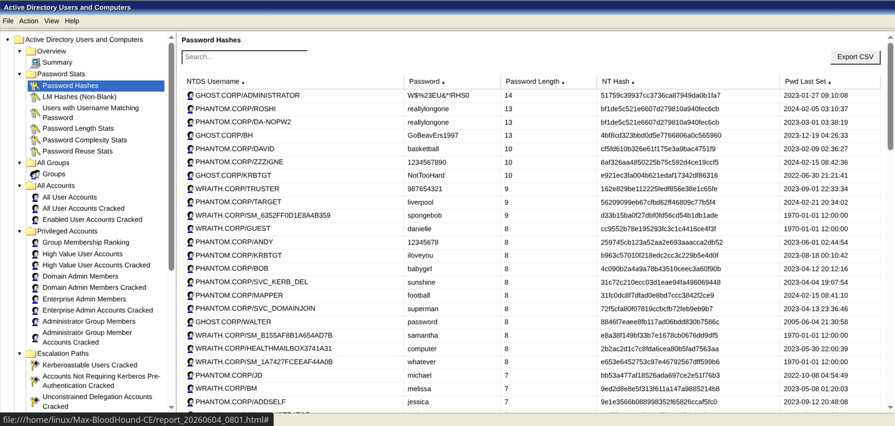
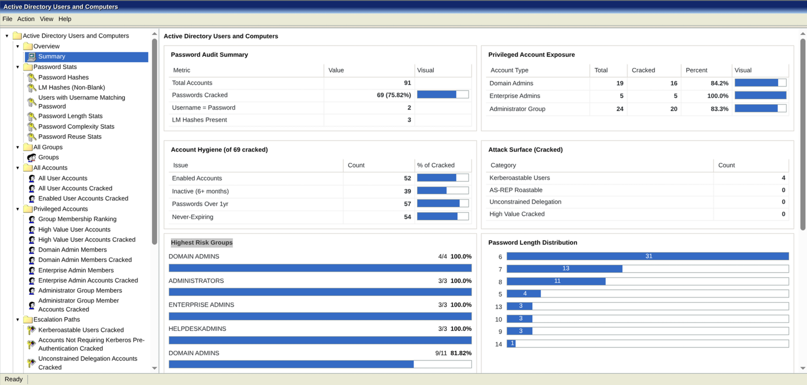
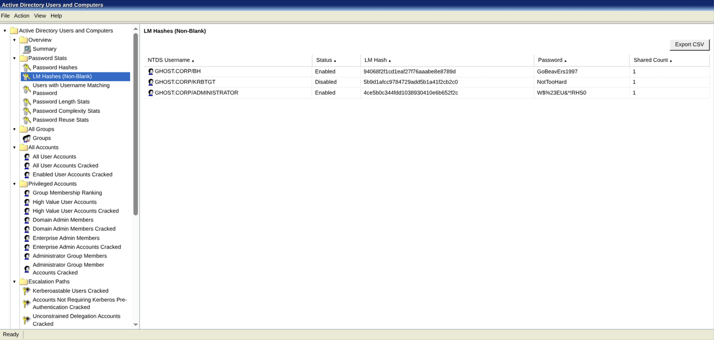
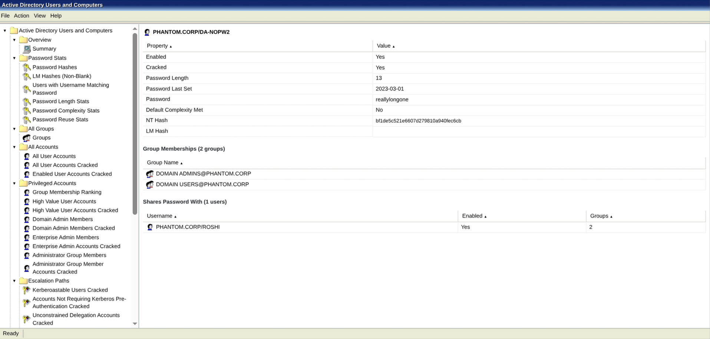
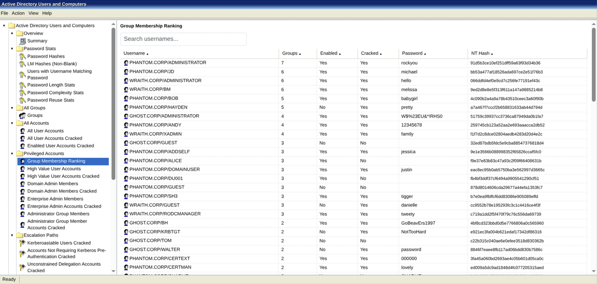
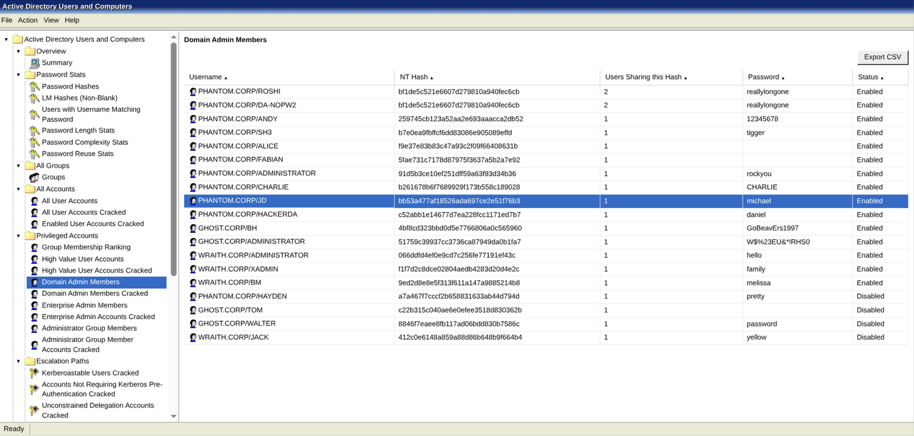

<p align="center">
  
  
  
</p>

<h1 align="center">Max - BloodHound CE Edition</h1>

<p align="center">
  <strong>Domain Password Audit Tool for BloodHound Community Edition with interactive single-file HTML reports and comprehensive password analytics.</strong>
</p>

<p align="center">
  <a href="#-quick-start">Quick Start</a> •
  <a href="#-try-with-sample-data">Sample Data</a> •
  <a href="#-features">Features</a> •
  <a href="#-report-gallery">Gallery</a> •
  <a href="#-all-modules">Modules</a> •
  <a href="#-credits">Credits</a>
</p>

<p align="center">
  <a href="https://github.com/exploit-development/Max-BloodHound-CE/raw/master/sample_report.html" target="_blank">
    
  </a>
</p>

<p align="center">
  
</p>

<p align="center">
  
  
</p>

---

<p align="center">
  
</p>

---

## Quick Start

```bash
git clone https://github.com/exploit-development/Max-BloodHound-CE.git
cd Max-BloodHound-CE
pip3 install -r requirements.txt

export NEO4J_PASSWORD='your-neo4j-password'
python3 max.py dpat -n customer.ntds -c hashcat.potfile
```

The report generates and auto-opens in your browser as a single portable HTML file.

---

## Try With Sample Data

Sample BloodHound data, NTDS, and potfile are all included. Follow these steps:

**Step 1 - Import the sample data into BloodHound CE:**

In the BloodHound CE web UI, go to **Administration > File Ingest** and upload all JSON files from `sample_data/ad_sampledata/`. This loads three domains (`PHANTOM.CORP`, `GHOST.CORP`, `WRAITH.CORP`) into the graph.

**Step 2 - Run the audit:**

```bash
export NEO4J_PASSWORD='your-neo4j-password'
python3 max.py dpat -n sample_data/customer.ntds -c sample_data/hashcat.potfile
```

The sample data includes 100 users and a populated potfile, enough to explore every section of the report.

---

## New Features

### Enhanced DPAT Module

| Feature | Description |
|---------|-------------|
| **Single-file HTML reports** | All CSS, JS, and icons embedded as base64 - one file, no dependencies |
| **Summary statistics page** | At-a-glance dashboard with charts and privileged account exposure |
| **Password reuse detection** | Shows all shared hashes, not just cracked passwords |
| **Blank password detection** | Flags accounts with empty NT hash (`31d6cfe0d16ae931b73c59d7e0c089c0`) |
| **LM hash cracking** | Improved LM hash parsing in potfiles |
| **Highest risk weights for groups** | Scored by `cracked_users x percentage` to prevent small 100% groups from overshadowing large compromised ones |
| **Group membership ranking** | Users ranked by total group count to surface over-privileged accounts |
| **Interactive drill-down** | Click any stat, username, group, or chart to navigate |
| **User detail pages** | Per-user view: groups, password info, and all accounts sharing the same hash |
| **Built-in CSV export** | Export button on every table |
| **Unsupported OS detection** | Flags end-of-life Windows with Windows 11 false-positive fix |

### BloodHound CE Fixes

| Fix | Description |
|-----|-------------|
| **Builtin Administrators group** | Fixed detection broken by the new collector's domain name appending |
| **Windows 11 false positive** | Unsupported OS query no longer flags Windows 11 as end-of-life |

---

## Report Gallery

<table>
  <tr>
    <td align="center"><br/><sub>Summary dashboard with privileged account exposure</sub></td>
    <td align="center"><br/><sub>Password hashes with crack status and reuse count</sub></td>
  </tr>
  <tr>
    <td align="center"><br/><sub>LM hashes (non-blank) detection</sub></td>
    <td align="center"><br/><sub>User detail page - groups, hash, and password sharing</sub></td>
  </tr>
  <tr>
    <td align="center"><br/><sub>Group membership ranking - spot over-privileged users</sub></td>
    <td align="center"><br/><sub>Domain Admins with shared hash correlation</sub></td>
  </tr>
</table>

---

## Command Options

```bash
python3 max.py dpat -n <ntds_file> -c <potfile> [options]
```

| Flag | Description |
|------|-------------|
| `-n, --ntds` | NTDS file (secretsdump format: `domain\user:RID:lm:nt:::`) |
| `-c, --crackfile` | Potfile of cracked hashes (Hashcat/JTR format: `hash:password`) |
| `-o, --output` | Output filename base (default: `report`) |
| `-t, --threads` | Threads for parsing (default: 2) |
| `-s, --sanitize` | Redact passwords and hashes in the report |
| `-S, --store` | Keep parsed data in BloodHound after completion |
| `--noparse` | Skip parsing - use data already stored in BloodHound |
| `--clear` | Remove all NTDS/password data from BloodHound |
| `--less` | Skip intensive queries (recommended for environments with more than 50k objects) |
| `-p, --password` | Find all users with a specific password |
| `-u, --username` | Look up the cracked password for a specific user |
| `--own-cracked` | Mark all cracked users as Owned in BloodHound |

### Common Workflows

**Large environments (more than 50k objects):**
```bash
python3 max.py dpat -n customer.ntds -c hashcat.potfile --less
```

**Parse once, query repeatedly:**
```bash
# First run - parse and store
python3 max.py dpat -n customer.ntds -c hashcat.potfile --store

# Subsequent runs - skip parsing
python3 max.py dpat --noparse
```

**Search for a specific password across all users:**
```bash
python3 max.py dpat --noparse -p "Summer2024!"
```

**Sanitised report for sharing:**
```bash
python3 max.py dpat -n customer.ntds -c hashcat.potfile --sanitize
```

---

## NTDS Extraction

**Step 1 - Dump from a Domain Controller (admin cmd):**
```cmd
ntdsutil "ac in ntds" "ifm" "cr fu c:\temp" q q
```

**Step 2 - Extract with secretsdump:**
```bash
secretsdump.py -system registry/SYSTEM -ntds "Active Directory/ntds.dit" LOCAL -outputfile customer
# On Kali: impacket-secretsdump
```

**Step 3 - Crack hashes with Hashcat:**
```bash
hashcat -m 1000 customer.ntds.ntds /path/to/wordlist -o hashcat.potfile
```

---

## All Modules

| Module | Description |
|--------|-------------|
| [dpat](wiki/dpat.md) | Domain Password Audit Tool - the main module |
| [get-info](wiki/get-info.md) | Query BloodHound for users, groups, paths |
| [mark-owned](wiki/mark-owned.md) | Mark objects as owned |
| [mark-hvt](wiki/mark-hvt.md) | Mark high value targets |
| [query](wiki/query.md) | Run custom Cypher queries |
| [add-spns](wiki/add-spns.md) | Add SPN relationships |
| [add-spw](wiki/add-spw.md) | Add "shares password with" relationships |
| [del-edge](wiki/del-edge.md) | Delete edges from the graph |
| [export](wiki/export.md) | Export BloodHound data |
| [pet-max](wiki/pet-max.md) | Pet the good boy |

---

## Requirements

- Python 3.6+
- BloodHound Community Edition with Neo4j running
- Neo4j accessible at `bolt://localhost:7687` (default)

---

## Credits

| | |
|---|---|
| [clr2of8](https://github.com/clr2of8/DPAT) | Original DPAT concept and implementation |
| [knavesec](https://github.com/knavesec/Max) | Max BloodHound toolkit |
| [aidanstansfield](https://github.com/knavesec/Max/pull/23) | LM hash potfile improvements |
| [exploit-development](https://github.com/exploit-development) | BloodHound CE port, Windows 2008 ADUC HTML report, and all enhancements |

---

<p align="center">
  <a href="https://github.com/exploit-development/Max-BloodHound-CE/stargazers">⭐ Star this repo</a> •
  <a href="https://github.com/exploit-development/Max-BloodHound-CE/issues">🐛 Report a bug</a> •
  <a href="https://github.com/exploit-development/Max-BloodHound-CE/issues">💡 Request a feature</a>
</p>
